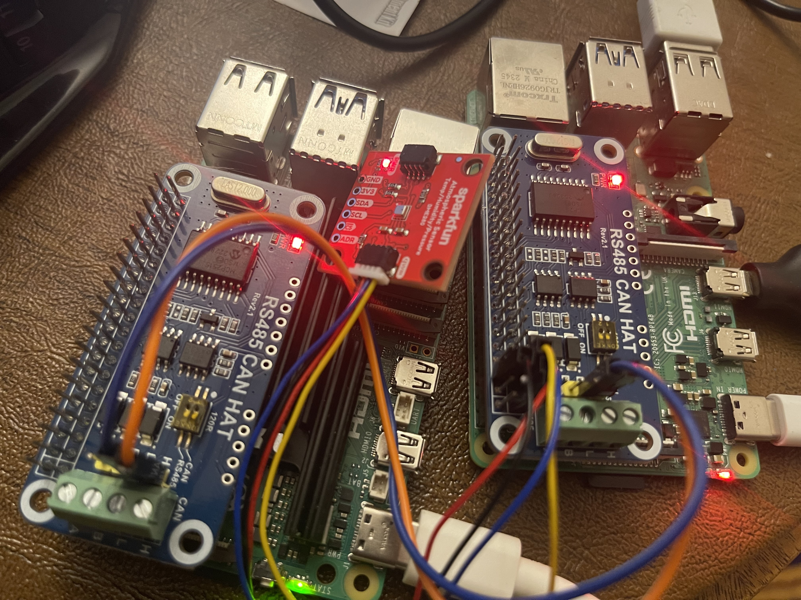
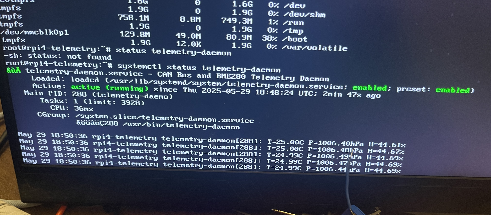
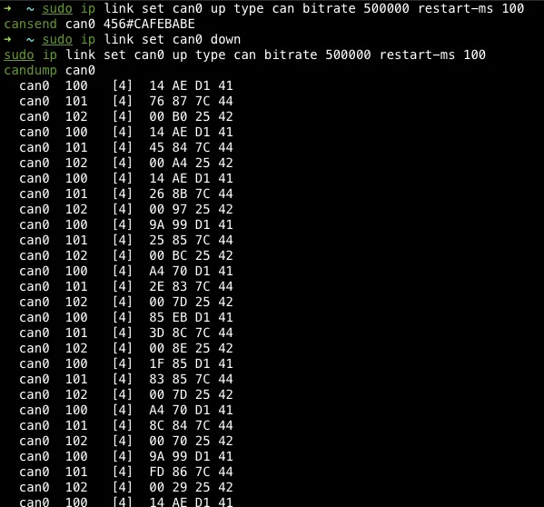

# Dual-Stack Embedded Linux Telemetry Platform

Embedded Linux telemetry system built with both Buildroot and 
Yocto, running on Raspberry Pi 4. The same application stack is built twice — once 
with each build system — enabling a direct comparison of toolchains, boot times, 
image sizes, etc. 

## Hardware

  


| Component | Purpose |
|---|---|
| Raspberry Pi 5 | Cross-compilation host |
| Raspberry Pi 4 | Target device |
| SparkFun BME280 | Temperature, pressure, humidity sensor (I2C) |
| Waveshare MCP2515 CAN HAT x2 | CAN bus transceivers (SPI) |

## System Architecture

```
Pi 5 (host):
BME280 ──I2C──► telemetry-daemon ──Unix socket──► logging-service ──► /var/log/telemetry.csv
                      │
                      └──CAN 0x100/0x101/0x102──► Pi4 candump
```

## Application Stack

### telemetry-daemon (C++)
- Reads BME280 sensor over I2C using direct ioctl calls (no libi2c dependency)
- Broadcasts sensor data as CAN frames on IDs 0x100 (temp), 0x101 (pressure), 0x102 (humidity)
- Streams formatted data to logging-service over Unix domain socket
- Managed by systemd, restarts automatically on failure


### logging-service (C++)
- Listens on Unix socket at /var/run/telemetry.sock
- Writes structured telemetry data to /var/log/telemetry.csv
- Managed by systemd, starts before telemetry-daemon

### CAN Bus Frames on Pi4


## Build Systems

### Buildroot
- Custom BR2_EXTERNAL tree with telemetry-daemon and logging-service packages
- systemd unit files for both services
- MCP2515 CAN HAT and BME280 I2C enabled via config.txt overlays
- Rootfs overlay for automatic I2C module loading

### Yocto
- Custom BSP layer: meta-pi4-telemetry
- Machine config: rpi4-telemetry (inherits raspberrypi4-64)
- BitBake recipes for telemetry-daemon and logging-service
- MCP2515 and I2C configured via RPI_EXTRA_CONFIG

## Build Instructions

### Buildroot

```bash
cd buildroot
make BR2_EXTERNAL=$(pwd)/../br-external raspberrypi4_64_defconfig
make BR2_EXTERNAL=$(pwd)/../br-external menuconfig
make BR2_EXTERNAL=$(pwd)/../br-external
# Flash output/images/sdcard.img to SD card
```

### Yocto

```bash
cd poky
source oe-init-build-env ../yocto-build
bitbake telemetry-image
# Flash tmp/deploy/images/rpi4-telemetry/telemetry-image-rpi4-telemetry.rootfs.wic.bz2
```

## Metrics

| Metric | Buildroot | Yocto |
|---|---|---|
| Image size | 153MB | 58MB compressed |
| Rootfs used | 77.7MB | 119MB |
| Boot to systemd targets | ~4.5 seconds | ~2.4 seconds |
| RAM at idle | 54.1MB | 85MB |
| Build time (cold) | ~1.5 hours | ~4 hours |
| Init system | systemd | systemd |
| Kernel | linux-rpi custom | linux-raspberrypi 6.6.63 |

## Project Structure

```
Dual-Stack-Linux-BuildSys/
├── buildroot/              # Buildroot source
├── br-external/            # Custom Buildroot packages
│   ├── package/
│   │   ├── telemetry-daemon/
│   │   └── logging-service/
│   └── rpi-firmware/
├── telemetry-daemon/       # C++ daemon source
│   ├── Src/
│   └── Drivers/
│       ├── BME280/
│       └── CAN/
├── logging-service/        # C++ logger source
├── poky/                   # Yocto Poky source
├── meta-pi4-telemetry/     # Custom Yocto BSP layer
│   ├── conf/machine/
│   └── recipes-telemetry/
├── yocto-build/            # Yocto build directory
├── COMPARISON.md           # Detailed build system comparison
└── README.md
```

## Summary

- Custom Buildroot external tree with BR2_EXTERNAL
- Yocto BSP layer development with BitBake recipes
- Cross-compilation from Pi 5 (host) to Pi 4 (target)
- Device tree overlay configuration for MCP2515 and BME280
- SocketCAN interface programming in C++
- I2C sensor driver implementation using direct ioctl
- Unix domain socket IPC between system services
- systemd service management and dependency ordering
- CAN bus network configuration at 500kbps


